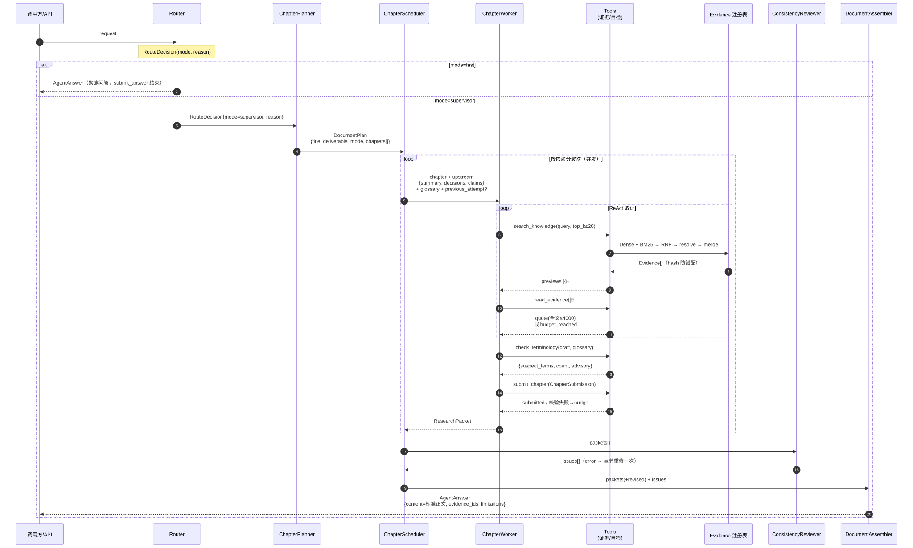

# 领域研究 Agent 系统架构（数据视图）

> 本图以「数据契约」为主线：阶段间传递的字段以 `src/research/agent_models.py`、
> `src/research/models.py` 中的 pydantic 模型为准，图里只标关键字段，改模型时同步改本文件即可。
> 代码锚点在每张表内标注，便于定位。

## 1. 总览（flowchart）



> 图源：`research-agent-flowchart.mmd`。改图后重渲染命令见第 7 节。

## 2. 一次 supervisor 请求的时序（sequenceDiagram）



> 图源：`research-agent-sequence.mmd`。改图后重渲染命令见第 7 节。

## 3. 阶段字段契约（入参 → 出参）

| 阶段 | 入参字段 | 出参字段 | 代码锚点 |
|---|---|---|---|
| Router | `request: str` | `route: RouteDecision{mode, reason}` | graph.py:1184 `route`；模型 agent_models.py:17 |
| FastAgent ReAct | `request` | `answer: AgentAnswer{content, evidence_ids, limitations}` | graph.py:1197；PROMPT graph.py:42 |
| ChapterPlanner | `request`（+ DocumentPlan JSON schema，失败自纠 1 次） | `plan: DocumentPlan{title, rationale, deliverable_mode, chapters[]}` | graph.py:1208 `plan_document` |
| ChapterScheduler | `plan` | `packets[]`（并发）；上游不满足 → `blocked` 包；首轮不足 → 用 `previous_attempt` 补研究一次 | graph.py:841 `_execute_plan`；checkpoint graph.py:935 |
| ChapterWorker ReAct | `document_title` / `deliverable_mode` / `document_structure[{ordinal, chapter_id, title}]` / `chapter`（ChapterPlan 全量）/ `upstream{chapters(summary,status), decisions(全量), claims(claim_id,text,conclusion_type,evidence_ids)}` / `glossary`（实际携带受控词条的决策）/ `previous_attempt{summary, gaps, diagnostics, evidence_ids}` | `ResearchPacket{task, chapter_id, chapter_title, depends_on, status, summary, content_blocks, claims, decisions, conflicts, gaps, diagnostics, evidence_ids}` | graph.py:735 `_run_chapter` 组装 request |
| ConsistencyReview | `plan` + `packets[]` | `issues[]`（ConsistencyIssue）+ 修订后 `packets` + `review_revised` | graph.py:1242 `review`；确定性检查 :960；修订 :1080 |
| DeterministicAssembler | `plan` + `packets` + `issues` | `AgentAnswer{content(纯 Markdown 正文), evidence_ids(去重), limitations}` | graph.py:1137 `_assemble_answer` |
| 持久化 | `AgentRun{}` 全量 | `run.json` | graph.py:1358 `run`；service.py:29 `RoutedResearchAgent.run` |

**ChapterPlan / DocumentPlan 子字段**（agent_models.py）：

- `ChapterPlan{chapter_id, ordinal, title, objective, research_questions[], depends_on[], produces_decisions[], required_decisions[], required_glossary[], acceptance_criteria[]}`（:22）
- `DocumentPlan{title, rationale, deliverable_mode: evidence_summary|normative_synthesis, chapters[ChapterPlan]}`（:35，含依赖环检测）
- `ResearchPacket` 内实体：`ContentBlock{block_id, heading=null, markdown, claim_ids, decision_ids, evidence_ids}`；`Claim{claim_id, text, conclusion_type, citations[evidence_id]}`；`DecisionRecord{decision_id, statement, decision_type, rationale, claim_ids, evidence_ids, assumptions[], alternatives[], validation_requirements[], confidence, applies_to_chapters[], glossary[]}`（agent_models.py:113/184，models.py:67）

## 4. 工具调用返回契约

| 工具 | 参数 | 返回 | 边界 / 预算 | 代码锚点 |
|---|---|---|---|---|
| `search_knowledge` | `query: str`；`top_k: 1..20` | JSON `[{evidence_id(E#), source_file, pages[], section_path, snippet≤600}]` | top_k≤20；命中证据写入一次请求级注册表并去重 | tools.py:311 / :260 / :273；检索链 retrieval/service.py:54 |
| `read_evidence` | `evidence_ids[] ≤4` | JSON `[{evidence_id, source_file, pages, section_path, quote(全文), quote_truncated}]`；或 `{status: budget_reached, available_evidence_ids, requested_in_budget}` | 单次 ≤4；本 run 累计 ≤ `max_evidence_reads`(默认 20)；未知 ID 抛错 | tools.py:324 / :278 / :337 |
| `check_terminology` | `content_blocks[]` + `decisions[]` | `{suspect_terms[{axis, term, canonical_terms}], count, advisory}` | 建议性：永不阻塞提交、不触发重跑；模式从规范词派生，不硬编码领域词汇 | tools.py:376 / :170 |
| `submit_chapter` | `ChapterSubmission{status, summary, content_blocks[], claims[], decisions[], conflicts[], gaps[], diagnostics[]}` | `"submitted"` 或校验错误（进入 ToolMessage status=error 由 nudge 修正重提） | 每章恰好 1 个 ContentBlock；正文字符 ≤ `min(chapter_max_chars, doc_max_chars/chapters)`；Claims ≤10、Decisions ≤4；Evidence 引用与哈希/页码/块归属校验 | graph.py:228 `_submit_chapter_tool`；`_validate_packet` :513 |
| `submit_answer` | `AgentAnswer{content, evidence_ids, limitations}` | `"submitted"` 或校验错误 | 必须至少检索过 1 次且 ≥1 evidence；公开正文不得含 `ev-*`/`C\d`/`D\d` | graph.py:206 / :454 `_validate_fast_answer` |

## 5. 检索 → 证据解析层（search_knowledge 内部数据流）

```
query
  ├─ Dense: BAAI/bge-m3 (1024d) + pgvector cosine HNSW
  └─ BM25: Jieba 搜索分词（文档名 + 标题路径 + 正文，不索引 MLLM visual_text）
        ↓ RRF 融合（可加权，默认等权）+ NoopReranker（预留）
SearchResult[] {chunk_id, content_hash, dense/bm25/fusion scores, final_rank}
  ↓ EvidenceResolver.resolve_many（contracts/search_result.py:7，evidence.py:24）
Evidence{e.v: ev-<hash12>, chunk_id, content_hash, document_id, source_file,
         page_start/end, section_path, block_ids, quote≤4000, quote_truncated,
         visual_assets[], retrieval[]}
  ↓ merge_evidence（evidence.py:68：同一 e.v 去重并保留多次查询痕迹；hash 不一致直接报错）
共享 Evidence 注册表（tools.py EvidenceWorkspace）
```

## 6. 重试 / 恢复上下文

- **首次回退**：章节 `insufficient` 且存在 `gaps` → 同一 Worker 二次 `_run_chapter(..., previous_attempt)`，仅注入 `summary/gaps/diagnostics/evidence_ids` 聚焦补检索（graph.py:813）。
- **一致性修订**：Reviewer 产生 `error` 级 issue → 对应章节把 `「Consistency review: 描述 / Required correction」` 追加到 `diagnostics` 后重修一次，仅成功（`sufficient`）才替换（graph.py:1080）。
- **resume/checkpoint**：`RunCheckpoint`（run_id, request, route, plan, evidence, worker_packets, evidence_aliases, parent_run_id, attempt）持久化；恢复时 `workspace.restore(checkpoint.evidence)` + `initial_packets` 避免重复执行已完成章节（graph.py:935 / :1385，service.py:68）。

## 7. 随代码演进（维护指南）

| 改动点 | 同步位置 |
|---|---|
| 阶段拓扑 / 顺序 | graph.py:1289 `_build_root_graph`（根图）；:841 `_execute_plan`（并发调度）→ 更新第 1、2 节 |
| 阶段间字段 | agent_models.py（AgentRun/RouteDecision/DocumentPlan/ChapterPlan/ChapterSubmission/ResearchPacket）与 models.py（Evidence/Claim/DecisionRecord/Conflict）→ 更新第 3 节表 |
| 提示词/约束 | graph.py:42-124（FAST/PLANNER/WORKER/REVIEW PROMPT）→ 校对第 4 节工具描述 |
| 工具行为/预算 | tools.py（make_retrieval_tools / make_terminology_tool），检索链路 retrieval/ → 更新第 4、5 节 |
| LangGraph 子图可直接导出 | `AgentRuntime(...)._fast_graph / graph .get_graph().draw_mermaid_png()`（需 graphviz），与第 1、2 节对照 |

### 重渲染 SVG（编辑 .mmd 后）

图源在 `docs/diagrams/*.mmd`，改完源码后用 `@mermaid-js/mermaid-cli` 重出 SVG（已用本机 Chrome，无需下载 Chromium）：

```bash
# 生成 puppeteer 配置指向本机 Chrome
echo '{"executablePath": "C:/Program Files/Google/Chrome/Application/chrome.exe", "args": ["--no-sandbox", "--disable-gpu"]}' > puppeteer.json

npx @mermaid-js/mermaid-cli -p puppeteer.json \
  -i research-agent-flowchart.mmd -o research-agent-flowchart.svg
npx @mermaid-js/mermaid-cli -p puppeteer.json \
  -i research-agent-sequence.mmd -o research-agent-sequence.svg
```

> Typora 打开 SVG 后如需放大：右键 → 在新标签页打开图片（浏览器里可任意缩放），或直接在 Typora 里放大字号前先在浏览器确认内容可读。

## 8. 范围说明

- `docs/开发主线.md` 提及的标准三件套（`standard.md` / `rules.json` / `traceability.json`）为文档规划的后续产物，agent 代码当前只产出 `run.json`，未在本图流程内。